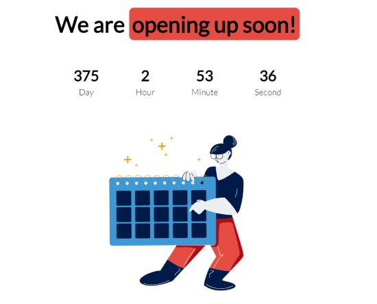

# Simple-Javascript-Countdown

## Description

It's a training project,
It is made with HTML, CSS, and pure JavaScript.
Basic Clock: Count down to a Specific Date and Time.

## Here’s a quick outline of the steps involved in creating a basic clock:

- Set a valid end date.
- Set a valid current date using `new Date().getTime()`.
- Difference between count date and current time
- Time works
- Calculate the time remaining.
- Convert the time to a usable format.
- Display the clock on the page

## Preview the website live on : [DEMO](https://carolinafledgling.github.io/Simple-Javascript-Countdown/)

## Screenshots

## Code Examples

The `getTime()` method returns the number of milliseconds.
A number representing the milliseconds elapsed between 1 January 1970 00:00:00 UTC and the given date.

###👉 More info: [getTime()](https://developer.mozilla.org/en-US/docs/Web/JavaScript/Reference/Global_Objects/Date/getTime)
